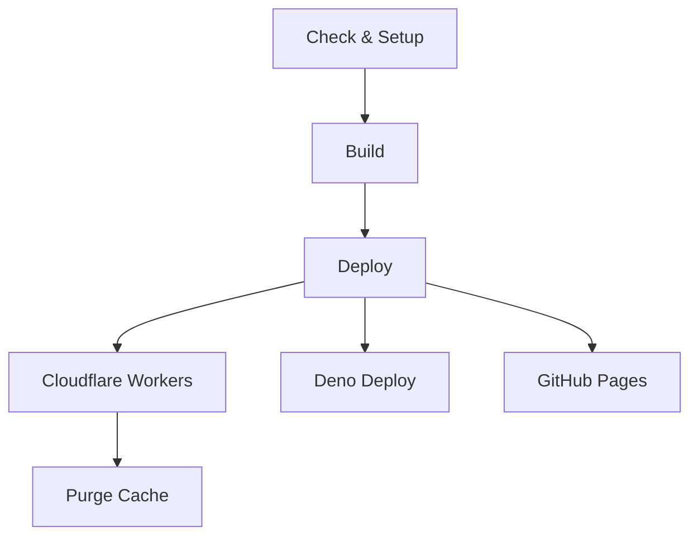

# CI/CD Implementation

### Continuous Integration/Deployment for the Revista project

---

## Overview

This project uses GitHub Actions for its CI/CD pipeline, automating builds and deployments to multiple targets including Cloudflare Workers, Deno Deploy, GitHub Pages. The pipeline is optimized for speed with parallel deployments and smart caching strategies.

## Workflow Architecture

The CI/CD pipeline consists of the following stages:



## Workflow File Structure

The primary workflow file is `.github/workflows/deploy.yml`, which orchestrates the entire process.

## Build Process

The build process supports multiple deployment targets with different configurations:

### Standard Build (Shared by Workers, Deno)

```yaml
jobs:
  build-revista:
    runs-on: ubuntu-latest
    steps:
      - uses: actions/checkout@v4

      - name: Setup Bun
        uses: oven-sh/setup-bun@v1

      - name: Cache dependencies
        uses: actions/cache@v4
        with:
          path: |
            ~/.bun/install/cache
            node_modules
          key: ${{ runner.os }}-bun-${{ hashFiles('**/bun.lock', '**/package.json', 'astro.config.mjs', 'tailwind.config.mjs') }}
          restore-keys: |
            ${{ runner.os }}-bun-${{ hashFiles('**/bun.lock', '**/package.json') }}-
            ${{ runner.os }}-bun-

      - name: Install dependencies
        run: bun install

      - name: Build site
        run: bun run build

      - name: Upload artifact
        uses: actions/upload-artifact@v4
        with:
          name: dist
          path: dist/
```

### GitHub Pages Build (Independent)

GitHub Pages uses its own build process to accommodate the different base path requirement:

```bash
# Environment variable sets GitHub Pages configuration
GITHUB_PAGES=true astro build && pagefind --site dist
```

This approach ensures:

- **Standard deployments** use `site: "https://www.erfianugrah.com"` with no base path
- **GitHub Pages** uses `site: "https://erfianugrah.github.io"` with `base: "/revista-3"`
- **Complete isolation** between deployment configurations

Key optimizations:

1. **Bun Instead of Node**: Uses Bun for significantly faster installations and builds
2. **Smart Dependency Caching**: Only invalidates cache when dependencies or config files change (not on every source change)
3. **Config-Based Cache Keys**: Includes `astro.config.mjs` and `tailwind.config.mjs` for precise invalidation
4. **Artifact Generation**: Uploads the build output for use in subsequent jobs
5. **Build Retry Logic**: Automatically retries failed builds up to 3 times

## Deployment Targets

### Cloudflare Workers (with Static Assets)

```yaml
deploy-to-cloudflare-workers:
  needs: build-revista
  runs-on: ubuntu-latest
  steps:
    - name: Checkout
      uses: actions/checkout@v4

    - name: Download built artifacts
      uses: actions/download-artifact@v4
      with:
        name: dist
        path: dist

    - name: Deploy to Cloudflare Workers
      uses: cloudflare/wrangler-action@v3
      with:
        apiToken: ${{ secrets.CLOUDFLARE_WRANGLER_TOKEN }}
        accountId: ${{ secrets.CLOUDFLARE_ACCOUNT_ID }}
        command: deploy
        packageManager: bun
```

Key points:

1. Uses Cloudflare Workers with Static Assets (not Pages)
2. Configured via `wrangler.jsonc` in repository root
3. Supports future hybrid SSR + static capabilities
4. Deploys to `revista.workers.dev` subdomain
5. Cache purge runs separately after all web deployments complete

### Deno Deploy

```yaml
deploy-to-deno:
  needs: build-revista
  if: github.event_name == 'push' || github.event_name == 'pull_request'
  runs-on: ubuntu-latest
  permissions:
    id-token: write
    contents: read
  steps:
    - name: Download build artifacts
      uses: actions/download-artifact@v4
      with:
        name: dist
        path: dist

    - name: Setup Deno
      uses: denoland/setup-deno@v1
      with:
        deno-version: v1.x

    - name: Deploy to Deno
      uses: denoland/deployctl@v1
      with:
        project: "revista-3"
        entrypoint: "https://deno.land/std@0.188.0/http/file_server.ts"
        root: "dist"
```

Authentication uses OIDC (`id-token: write`) rather than a deploy token - no secret management needed.

### GitHub Pages

```yaml
deploy-to-github-pages:
  runs-on: ubuntu-latest
  permissions:
    contents: read
    pages: write
    id-token: write
  concurrency:
    group: "pages"
    cancel-in-progress: false
  environment:
    name: github-pages
    url: ${{ steps.deployment.outputs.page_url }}
  steps:
    - name: Checkout repository
      uses: actions/checkout@v4

    - name: Setup Bun environment
      uses: oven-sh/setup-bun@v1

    - name: Cache dependencies
      uses: actions/cache@v4
      with:
        path: |
          ~/.bun/install/cache
          node_modules
        key: ${{ runner.os }}-bun-${{ hashFiles('**/bun.lock') }}-${{ hashFiles('**/package.json') }}
        restore-keys: |
          ${{ runner.os }}-bun-${{ hashFiles('**/bun.lock') }}-
          ${{ runner.os }}-bun-

    - name: Install project dependencies
      run: bun install

    - name: Build for GitHub Pages
      run: bun run build:github-pages

    - name: Setup Pages
      uses: actions/configure-pages@v5

    - name: Upload to GitHub Pages
      uses: actions/upload-pages-artifact@v3
      with:
        path: dist

    - name: Deploy to GitHub Pages
      id: deployment
      uses: actions/deploy-pages@v4
```

Key features:

1. **Independent Build Process**: Unlike other deployments, GitHub Pages builds from source with its own environment
2. **Environment-Specific Configuration**: Uses `GITHUB_PAGES=true` environment variable to set correct `site` and `base` paths
3. **Dedicated Build Command**: Uses `build:github-pages` npm script for proper base path configuration
4. **Proper Permissions**: Configures Pages write access and OIDC token authentication
5. **Concurrency Control**: Prevents conflicting deployments with proper job isolation
6. **Latest GitHub Actions**: Uses official Pages Actions (configure-pages@v5, upload-pages-artifact@v3, deploy-pages@v4)

### Optimization Strategies

1. **Smart Caching**: Cache keys only invalidate on actual dependency/config changes (not on every source file change)
2. **Parallel Deployments**: Web deployments (Workers, Deno, Pages) run simultaneously
5. **Artifact Sharing**: Build once, deploy to multiple targets from shared artifact
6. **Bun Runtime**: Significantly faster than npm for installation and building

### Pipeline Timing

**Critical Path (Web Deployments):**

```
build-revista:              ~2 min (optimized caching)
  ├─ deploy-to-workers:     ~1 min
  ├─ deploy-to-deno:        ~1 min
  └─ deploy-to-github-pages: ~3 min (independent build)
  └─ purge-cache:           ~5 sec (depends on Workers only)
─────────────────────────────────────
Total critical path:        ~5 min ⚡
```

- **Overall speedup:** 3x faster for critical web deployment path
