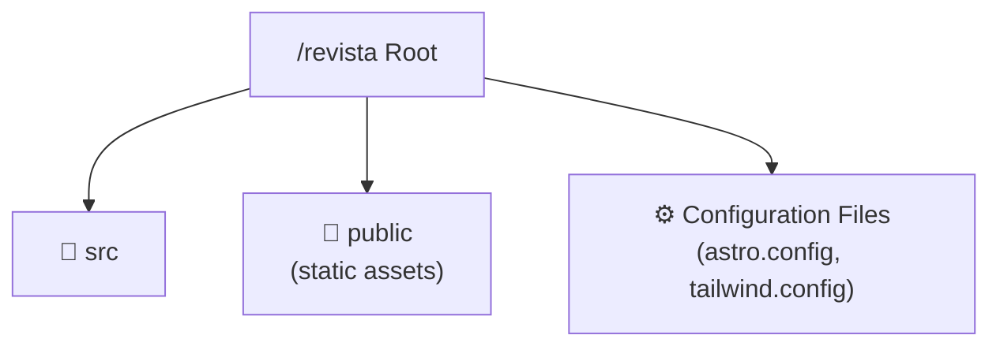
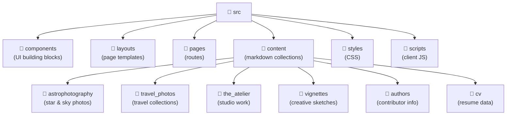
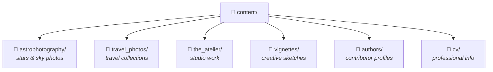
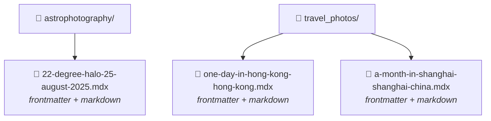
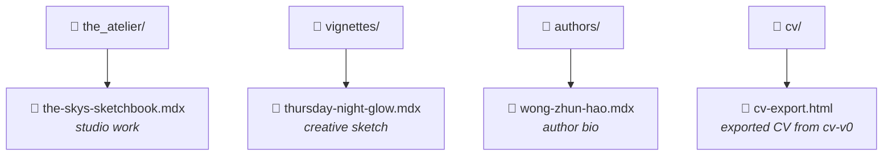
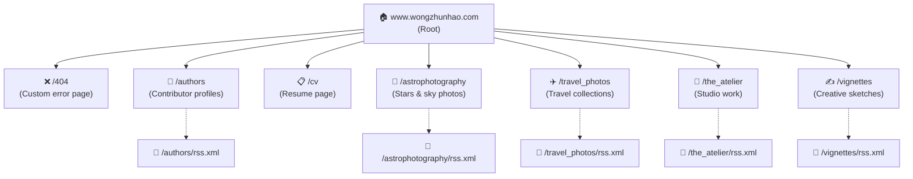
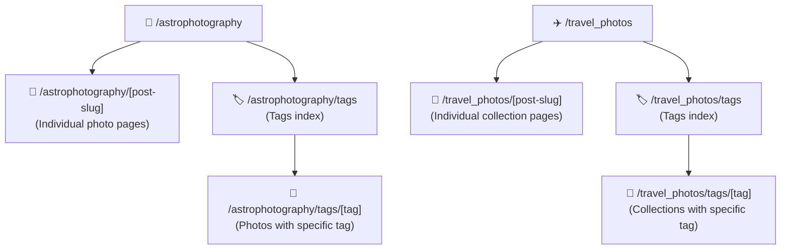
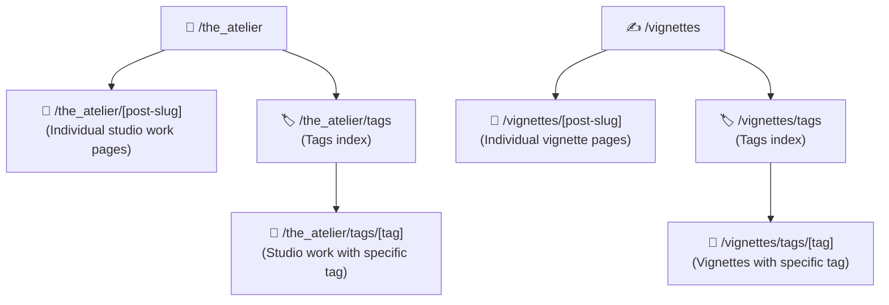

<p>
  
  
  
  
  
  
  
  <br/>
  
</p>

## Quick Links

- Documentation Index: `docs/README.md`

## Overview

wongzhunhao.com is a photography portfolio and creative collection built on Astro v6.0.1. It showcases various photography and creative work organized into different collections: astrophotography, travel photos, studio work (the atelier), creative vignettes, and a CV. The project prioritizes speed and visual design while using Astro's content collection API to manage everything efficiently.

The site deploys to Cloudflare Workers Static Assets via Workers Builds (Cloudflare's dashboard git integration), with no GitHub Actions deploy step.

## Documentation Map

- **Docs Index:** `docs/README.md`
- **Architecture:** `src/README.md`
- **Performance:** `docs/performance.md`
- **CI/CD & Deployments:** `.github/CICD.md`
- **Components:** `src/components/README.md`
- **Layouts:** `src/layouts/README.md`
- **Pages:** `src/pages/README.md`
- **Content Collections:** `src/content/README.md`

## Project Structure

<details>
<summary>Project Structure Diagram (click to expand)</summary>

### Top-Level Structure



### Source Directory Structure



### Component Files

```mermaid
graph TD
    E["📁 components"] --> E1["🧩 BlogPost.astro"]
    E --> E2["🧩 Footer.astro"]
    E --> E3["🧩 Header.astro"]
    E --> E4["🧩 Navigation.astro"]
    E --> E5["🧩 Homepage.astro"]
    E --> E6["🧩 Masonry.astro"]
    E --> E7["🧩 HeroImage.tsx"]
    E --> E8["🧩 NextPost.astro"]
    E --> E9["🧩 ThemeToggle.tsx"]

    F["📁 layouts"] --> F1["📄 BaseLayout.astro"]
    F --> F2["📄 MarkdownPostLayout.astro"]
    F --> F3["📄 AuthorLayout.astro"]
    F --> F4["📄 TagLayout.astro"]

    G["📁 pages"] --> G1["🌐 index.astro<br>(homepage)"]
    G --> G2["🌐 404.astro<br>(error page)"]
    G --> G3["🌐 cv.astro<br>(resume)"]

    I["📁 styles"] --> I1["🎨 global.css<br>(site-wide styles)"]
    I --> I2["🎨 MasonryLayout.css<br>(photo grid styling)"]

    J["📁 scripts"] --> J1["⚡ theme.ts<br>(dark/light mode)"]
    J --> J2["⚡ lightbox.ts<br>(image lightbox)"]
```



</details>

### Key Directories and Files

- `src/`: Contains the main source code for the site
  - `components/`: Reusable Astro components ([Components Documentation](src/components/README.md))
    - `BlogPost.astro`: Component for rendering individual blog post previews
    - `Footer.astro`: Site-wide footer component
    - `Header.astro`: Site-wide header component
    - `Navigation.astro`: Navigation menu component
  - `layouts/`: Page layouts used across the site ([Layouts Documentation](src/layouts/README.md))
    - `BaseLayout.astro`: The main layout used by most pages
    - `MarkdownPostLayout.astro`: Layout for rendering Markdown content
  - `pages/`: Astro pages that generate routes ([Pages Documentation](src/pages/README.md))
    - `index.astro`: The home page
    - `404.astro`: Custom 404 error page
    - `cv.astro`: CV page
  - `content/`: Markdown content for blog posts and collections ([Content Collections Documentation](src/content/README.md))
  - Architecture and implementation documentation:
    - [Technical Architecture](src/README.md): Component structure, state management, and design patterns
    - [Performance Optimization](docs/performance.md): Techniques used for site speed optimization
    - [CI/CD Implementation](.github/CICD.md): Build and deployment automation
  - `content.config.ts`: Configuration file for content collections using Astro's glob loader pattern
  - `styles/`: CSS files for styling
    - `global.css`: Global styles and Tailwind v4 imports
    - `MasonryLayout.css`: Styles for the masonry layout used in galleries
  - `scripts/`: TypeScript files for client-side functionality
    - `theme.ts`: Shared theme preference, apply, toggle, and init helpers
    - `lightbox.ts`: Custom image lightbox with keyboard/touch navigation
    - `homePage.ts`: Homepage dynamic content and random image selection
    - `getrandomimage.ts`: Random featured image selection for tag pages
    - `burgundy.ts`: 404 page quote rotation
    - `rss.ts`: RSS link visibility and URL management
    - `undici-retry.ts`: HTTP fetch retry helper for build-time requests
    - `utils.ts`: Shared `shuffle()` and `formatDate()` utilities
    - `collections.ts`: Shared `buildDetailPaths()`, `buildTagPaths()`, `generateRss()` helpers

- `public/`: Static assets like images and fonts
- Configuration files:
  - `astro.config.mjs`: Astro configuration
  - `tailwind.config.mjs`: Tailwind CSS configuration
  - `tsconfig.json`: TypeScript configuration

## Key Features

1. **Multiple Content Collections**: The site organizes content into different types (astrophotography, travel_photos, the_atelier, vignettes, authors, cv), each managed as an Astro content collection using the glob loader pattern. This gives me type-safe content management, explicit file selection, and simplified querying.

2. **Responsive Design**: The site uses Tailwind CSS for a mobile-first approach. I've customized the breakpoints to match my specific needs at 800px, 1200px, 1900px, 2500px, and 3800px, which ensures the site looks good on everything from phones to ultra-wide monitors.

3. **Dark Mode**: Users can toggle between light and dark themes with the ThemeToggle component. Theme preference is stored in localStorage so it persists across visits. The dark theme uses a deep charcoal background with light text for comfortable reading at night.

4. **Dynamic Routing**: Routes are generated from the content collections themselves. Each post and tag gets its own URL automatically, making content organization much simpler.

5. **RSS Feeds**: Each content collection has its own RSS feed. I use `@astrojs/rss` to generate these dynamically, so readers can subscribe to just the content types they're interested in.

6. **SEO Optimization**: Every page includes customizable meta tags for titles, descriptions, and Open Graph data, which helps with search engine visibility and social sharing.

7. **Performance Focus**: Astro's static site generation gives the site exceptional loading times. I've also implemented lazy loading for images and prefetching for linked pages to make navigation feel instantaneous.

8. **Interactive Elements**: The site uses targeted client-side JavaScript for the mobile menu, theme toggle, and image lightbox functionality, keeping the bundle size small while adding important interactivity.

9. **Custom 404 Page**: I created a unique 404 error page featuring rotating quotes from Ron Burgundy – a little humor to lighten the mood when someone hits a missing page.

10. **CV Section**: The site includes a dedicated CV page, which shows how this platform works not just for photography and writing but also for personal branding.

## Content Management

All content lives in Markdown files located in the `src/content/` directory. Each content type has its own subdirectory.

### Content Management Tools

The project includes custom CLI tools for creating and managing content:

#### Build Commands

```bash
# Development server
bun run dev

# Standard production build
bun run build

# Preview production build
bun run preview
```

### Content Creation CLI

```bash
# Run the content creator
bun run create

# Specify content type directly
bun run create -t astrophotography

# Preview frontmatter without creating a file (dry run)
bun run create --dry-run
# or
bun run create -d

# Show help for all options
bun run create --help

# Non-interactive mode (for scripts or automated workflows)
bun run create --non-interactive --type astrophotography --title "Post Title" --description "Post description" --tags "tag1,tag2" --pub-date "2024-05-19T12:00:00Z" --updated-date "2024-05-20T10:00:00Z"
```

This interactive tool:

- Dynamically reads schema requirements from content.config.ts
- Provides a user-friendly interface with colored prompts
- Validates input according to schema requirements
- Generates proper filenames using date-slug.mdx pattern (uses pubDate for the filename when provided)
- Supports all content types: astrophotography, travel_photos, the_atelier, vignettes, authors, cv

#### Post Update Tool

```bash
# Update an existing post's frontmatter (e.g., add/modify updated date)
bun run update-post --file astrophotography/2026-03-14-22-degree-halo-25-august-2025.mdx --updated-date "2026-03-15T12:00:00Z"

# Preview changes without writing to file
bun run update-post --file travel_photos/2026-01-10-one-day-in-hong-kong-hong-kong.mdx --tags "travel,asia,photography" --dry-run

# Update multiple fields at once
bun run update-post --file astrophotography/2026-03-14-22-degree-halo-25-august-2025.mdx \
  --title "New Title" \
  --tags "astrophotography,optics,sky" \
  --updated-date "2026-03-15T08:15:00Z"
```

This tool allows you to:

- Update publication or update dates
- Change tags or categories
- Update image metadata
- Modify titles or descriptions
- Preview changes before applying them

For detailed documentation on both tools, see [scripts/README.md](scripts/README.md).

<details>
<summary>Content Management Diagram (click to expand)</summary>

### Content Directory Structure



### Content Files by Type



### Specialized Content Types



</details>

Each content collection is defined with a specific schema in `content.config.ts` using Zod for validation. Here's a simplified example of the frontmatter structure:

```typescript
// content.config.ts — shared base schema eliminates duplication across collections
const baseSchema = z.object({
  title: z.string(),
  tags: z.array(z.string()),
  author: z.string(),
  description: z.string(),
  image: z.object({
    src: z.string(),
    alt: z.string(),
    positionx: z.string().optional(),
    positiony: z.string().optional(),
  }).optional(),
  pubDate: z.coerce.date(),
  updatedDate: z.coerce.date().optional(),
});

const astrophotography = defineCollection({
  loader: glob({ pattern: "**\/[^_]*.mdx", base: "./src/content/astrophotography" }),
  schema: baseSchema,
});

// Example frontmatter from an actual astrophotography post:
---
title: "22 Degree Halo - 25 August 2025"
pubDate: 2026-03-14T12:00:00.000Z
tags: [ 'astrophotography', 'optics' ]
author: "Zhun Hao"
image:
  src: "https://www.wongzhunhao.com/astrophotography/halo_2025/22-degree-halo.avif"
  alt: "A 22 degree halo surrounding the moon, a luminous ring created by ice crystal refraction in the upper atmosphere."
  positionx: "50"
  positiony: "50"
description: "Captured a beautiful 22 degree halo around the moon on the evening of August 25, 2025. An optical phenomenon caused by ice crystals in the atmosphere refracting light."
---

The phenomenon occurs when hexagonal ice crystals in cirrus clouds refract moonlight at a specific angle...
```

Each Markdown file includes frontmatter with metadata like title, publication date, tags, and image information. I define the content collections in `src/content.config.ts`, which specifies the schema using Zod for runtime type checking and uses Astro's glob loader pattern to identify which files belong to each collection.

## Routing

Revista uses a mix of file-based routing and dynamic route generation:

<details>
<summary>Routing Diagram (click to expand)</summary>

### Main Routes



### Astrophotography and Travel Photos Routes



### The Atelier and Vignettes Routes



</details>

The routing system combines static and dynamic routes:

- **Static routes** like `/astrophotography` are defined by files at `src/pages/astrophotography.astro`
- **Dynamic routes** like `/astrophotography/22-degree-halo-25-august-2025` are handled by `src/pages/astrophotography/[...id].astro`
- **Collection pages** use `getStaticPaths()` to generate routes from content collections
- **Tag pages** are automatically generated for each tag used in the content

Each collection follows the same pattern of routes: index, individual posts, tags index, and tag-specific pages.

### Route Explanation:

1. **Root and Static Routes**:
   - `/`: Home page (`src/pages/index.astro`)
   - `/404`: Custom 404 error page (`src/pages/404.astro`)
   - `/authors`: Authors page (`src/pages/authors.astro`)
   - `/cv`: CV page (`src/pages/cv.astro`)

2. **Collection Routes**:
   For each collection (astrophotography, travel_photos, the_atelier, vignettes):
   - `/{collection}`: Index page for the collection (`src/pages/{collection}/index.astro`)
   - `/{collection}/post-id`: Individual post pages (`src/pages/{collection}/[...id].astro`)
   - `/{collection}/tags`: Tag index for the collection (`src/pages/{collection}/tags/index.astro`)
   - `/{collection}/tags/tag-name`: Pages for specific tags (`src/pages/{collection}/tags/[tag].astro`)

3. **Dynamic Route Generation**:
   - Post pages (e.g., `/astrophotography/22-degree-halo-25-august-2025`) are generated dynamically based on the content in the respective collection using `getStaticPaths()` in `[...id].astro`.
   - Tag pages (e.g., `/astrophotography/tags/astrophotography`) are generated for each unique tag used in the collection, also using `getStaticPaths()` in `[tag].astro`.

4. **RSS Feeds**:
   - Each collection has an RSS feed available at `/{collection}/rss.xml`, generated by `rss.xml.ts` files in each collection's directory.

## Styling System

The site uses Tailwind CSS v4.1.17 for styling, with carefully configured settings in `tailwind.config.mjs` to create a cohesive design system:

### Design System Components

1. **Typography System**
   - **Custom Fonts**: The site uses two variable fonts for better performance and flexibility:
     - "Overpass Mono Variable": A monospace font for code, technical details, and headers
     - "Inconsolata Variable": A secondary monospace used for specific UI elements
   - These fonts were chosen for their:
     - Technical, precise aesthetic that complements photography
     - Excellent readability at different sizes
     - Variable font support for optimal performance
     - Wide character set support
2. **Color System**
   - **Base Light Theme**: Clean white background (#f2f2f2) with deep charcoal text (#333333)
   - **Dark Theme**: Rich dark background (#222125) with high-contrast light text (#f5f5f5)
   - **Accent Colors**: Minimal use of accent colors, focusing on photography as the visual focus
   - **Photography-Optimized**: The color scheme is designed to enhance rather than compete with images

3. **Layout System**
   - **Photography-Specific Breakpoints**: Custom breakpoints designed for optimal image viewing:
     ```js
     // tailwind.config.mjs
     screens: {
       'sm': '800px',   // Small devices (tablets)
       'md': '1200px',  // Medium devices (laptops)
       'lg': '1900px',  // Large devices (desktops)
       'xl': '2500px',  // Extra large (large monitors)
       '2xl': '3800px', // Ultra-wide displays
     }
     ```
   - These breakpoints are significantly different from Tailwind defaults, prioritizing photography display over conventional web design breakpoints

4. **Component Styling**
   - **Custom Utilities**: Extended Tailwind with utilities for:
     ```js
      extend: {
        objectPosition: {
          'top-33': 'center top 33.33%',
          'top-50': 'center top 50%',
        },
        // Other extended utilities
      }
     ```
   - **Typography Plugin**: The `@tailwindcss/typography` plugin provides rich styling for long-form content

### Styling Implementation

1. **Dark Mode Strategy**
   - **Class-based Implementation**: The `dark` class on `<html>` drives Tailwind's dark variant. Theme state is managed by `src/scripts/theme.ts` and toggled via the `ThemeToggle.tsx` React component.

2. **CSS Organization**
   - **Global Styles**: `src/styles/global.css` contains:

     ```css
     /* Tailwind v4 single import */
     @import "tailwindcss";
     @config '../../tailwind.config.mjs';

     /* Global custom styles */
     :root {
       /* Custom CSS variables */
     }

     /* Dark mode specific overrides */
     .dark {
       /* Dark mode CSS variables */
     }
     ```

   - **Component-specific CSS**:
     - `MasonryLayout.css`: Custom grid-based implementation
     - `lightbox.css`: Custom lightbox styling (fade transitions, overlay, controls)

3. **CSS-in-JS Integration**
   - The project uses minimal CSS-in-JS, primarily in the React components like `ThemeToggle.tsx` and `HeroImage.tsx`, where dynamic styling is needed

### Style Architecture Principles

1. **Component-First Approach**: Styles are primarily applied using Tailwind utility classes in components
2. **Minimal Custom CSS**: Custom CSS is only used for complex layouts that Tailwind can't easily handle
3. **Consistent Color Variables**: Color references use CSS variables for theme consistency
4. **Media Query Standardization**: All responsive designs use the custom breakpoint system
5. **Print Considerations**: Special styling for PDF/print versions of content (especially CV)

## Scripts and Utilities

Client-side JavaScript lives in the `src/scripts/` directory, providing essential interactivity while maintaining a focus on performance:

### Core UI Scripts

- **`theme.ts`**: Shared theme management module with the following features:
  - `getThemePreference()`: reads from localStorage, falls back to `prefers-color-scheme`
  - `applyTheme()`: adds/removes the `dark` class on the document root
  - `toggleTheme()`: cycles the theme and persists to localStorage
  - `initTheme()`: inline-safe initialiser used by ThemeToggle.astro to prevent FOUC

### Media Management

- **`lightbox.ts`**: Custom image lightbox (replaced GLightbox - 73 KB -> ~2.4 KB gzipped):
  - Multi-level zoom: click cycles 2x -> 3.5x -> reset; scroll wheel for cursor-anchored incremental zoom (up to 5x); continuous pinch zoom on touch
  - Zoom uses `scale() + translate3d()` - a single CSS transform, pure compositor operation, no layout recalculation on any frame
  - Keyboard navigation (arrow keys, Escape zooms out first then closes)
  - Touch swipe navigation at 1x, drag/pan when zoomed
  - Fade transitions, prev/next/close/zoom controls, image counter
  - Adjacent image preloading, body scroll lock
  - Full View Transitions lifecycle support (destroy/reinit on `astro:page-load`)

- **`getrandomimage.ts`**: Helper utility used by components to select random featured images
  - Used in both the homepage and tag pages
  - Ensures images don't repeat in the same view
  - Handles empty image arrays gracefully

### Content Enhancement

- **`burgundy.ts`**: Creates the dynamic quote system for the 404 page:
  - Stores a collection of Ron Burgundy quotes
  - Randomly selects and displays a different quote on each page load
  - Sets up a rotating quote system with fade transitions

- **`rss.ts`**: Manages RSS subscription features:
  - Conditionally shows/hides RSS links based on the current page
  - Updates RSS link URLs dynamically
  - Provides visual feedback when subscription options are available

- **`homePage.ts`**: Powers the dynamic homepage content:
  - Selects featured content from different collections
  - Uses Fisher-Yates shuffle (from `utils.ts`) to randomize the selection
  - Ensures fresh content appears on each page load

### Shared Utilities

- **`utils.ts`**: Common helpers shared across scripts:
  - `shuffle()`: Fisher-Yates array shuffle
  - `formatDate()`: consistent date formatting using native `Date.toDateString()`

- **`collections.ts`**: Shared content collection helpers:
  - `CollectionName` type: union of all content collection keys (`"muses" | "short_form" | …`), used across layouts and pages for type-safe `getCollection()` calls
  - `buildDetailPaths()`: generates `getStaticPaths` for `[...id].astro` pages
  - `buildTagPaths()`: generates `getStaticPaths` for `tags/[tag].astro` pages
  - `generateRss()`: generates RSS feed XML for any collection

### Build Utilities

- **`remark-reading-time.mjs`**: MDX plugin that calculates and adds reading time estimates to posts

All scripts are TypeScript (except the remark plugin which remains `.mjs`), minimal, focused, and non-blocking to maintain the site's performance profile.

### Build Pipeline

- **`prebuild`** (automatic): Runs `scripts/sync-readme-versions.js` to keep version badges in docs in sync with `package.json`.
- **`postbuild`** (automatic): Runs Pagefind indexing over the `dist/` output.

## Astro Configuration Highlights

The `astro.config.mjs` includes several features worth noting:

1. **Math Rendering**: `remark-math` + `rehype-katex` for LaTeX-style equations in MDX content
2. **MDX remarkPlugins**: The `mdx()` integration carries its own `remarkPlugins` array (`remarkGfm`, `remarkMath`, `remarkReadingTime`) because MDX replaces (not merges with) the base `markdown.remarkPlugins` when it specifies its own. This ensures GFM tables and reading-time estimates work in `.mdx` files.
3. **Markdoc Integration**: `@astrojs/markdoc` available alongside MDX for content authoring
4. **Dual Shiki Themes**: Syntax highlighting uses `rose-pine-dawn` (light) and `tokyo-night` (dark) with `defaultColor: false` so both themes are emitted and CSS controls which one is visible
5. **Sitemap Generation**: `@astrojs/sitemap` automatically generates `sitemap-index.xml` during build
6. **Experimental Client Prerendering**: `clientPrerender: true` enables speculative prerendering of linked pages for near-instant navigation
7. **Experimental Fonts API**: Fonts (Inconsolata, Overpass Mono) are loaded via Astro's font provider system with `optimizedFallbacks: true` for reduced CLS
8. **undici-retry**: Custom Astro integration (`src/scripts/undici-retry.ts`) that patches the global fetch with retry logic for build-time HTTP requests

## Performance Optimization

I've optimized the site in several ways:

1. **Image Processing**: Using Astro's `getImage` function to convert images to efficient formats and appropriate dimensions.

2. **Lazy Loading**: Images load on demand using the `loading="lazy"` attribute, which prevents initial page load delays.

3. **Preloading and Prefetching**: Astro's `prefetch` feature loads linked pages before the user clicks, making navigation feel instant.

4. **Efficient Bundling**: Astro v6.0.1 includes improved bundling and tree-shaking to minimize client-side code, with enhanced hydration strategies and faster component rendering.

5. **Cloudflare CDN**: The site uses Cloudflare's CDN with custom cache headers to serve content from edge locations worldwide.

6. **Tailwind Optimizations**: Tailwind CSS v4.1.17's improved performance and lighter bundle size help pages load quickly.

## Search Functionality

The site includes search powered by [Pagefind](https://pagefind.app/), integrated into the `Navigation.astro` component through the `Pagefind.astro` component. This search implementation provides:

1. **Comprehensive Content Indexing**: Automatically indexes all site content during the build process (via a postbuild script defined in package.json)

2. **Modal Search Interface**: A clean, accessible modal dialog that appears when users click the search button

3. **Dark Mode Support**: Custom CSS variables in the Pagefind component ensure the search UI respects the site's dark/light theme setting

4. **Sub-Results Display**: Shows nested results for more detailed content exploration with the `showSubResults: true` option

5. **Keyboard Navigation**: Supports keyboard focus and navigation for accessibility

6. **Responsive Design**: Adapts to different screen sizes with custom widths for mobile and desktop

The search functionality is implemented with minimal JavaScript and maintains the site's performance focus by loading the search UI assets only when needed.

```html
<!-- Simplified from Pagefind.astro -->
<button id="searchButton" aria-haspopup="dialog">Search</button>

<dialog id="searchDialog" class="search-dialog">
  <div class="dialog-content">
    <button id="closeButton" class="close" aria-label="Close search">
      &times;
    </button>
    <div id="search" class="m-8"></div>
  </div>
</dialog>

<script>
  document.addEventListener("astro:page-load", () => {
    const dialog = document.getElementById("searchDialog");
    // dialog.showModal() / dialog.close() for open/close

    new PagefindUI({
      element: "#search",
      showSubResults: true,
      resetStyles: false,
    });
  });
</script>
```

## Internationalization

While the site is currently in English, I've structured it with future translation in mind:

1. The RSS feeds include language tags (`<language>en-us</language>`)
2. The content structure would easily support localized content in additional languages

## External Integrations

1. **Cloudflare Workers Static Assets**: hosts the site at `wongzhunhao.com`. Workers Builds (the dashboard's git integration) auto-builds and deploys on push to `main`, with atomic per-deploy cache invalidation.
2. **`www.wongzhunhao.com`**: separate origin used as a CDN for image source files referenced from MDX frontmatter (`image.src` URLs). Astro fetches these at build time for Sharp processing.

## Development Tools

1. **Bun**:
   - Works as both the JavaScript runtime and package manager
   - Significantly faster than Node.js and npm, especially on M-series Macs
   - All scripts in `package.json` run through Bun

2. **TypeScript**:
   - The project uses TypeScript v5.9.3 throughout
   - Astro's built-in TypeScript support with `@astrojs/check` v0.9.6 catches type errors during build

3. **Prettier**:
   - Code formatting with Prettier v3.7.4 ensures consistent style
   - The Astro Prettier plugin (prettier-plugin-astro v0.14.1) properly formats .astro files

4. **Tailwind CSS v4**:
   - The latest Tailwind CSS v4.1.17 with better performance and smaller bundles
   - Configured with the typography plugin for long-form content

## CI/CD Workflow

- **Cloudflare Workers Builds** (the dashboard's git integration) is the sole deployment path: it watches `main`, runs `bun run build`, and uploads `dist/` to Workers Static Assets. There is no GitHub Actions deploy job.
- **GitHub Actions** (`.github/workflows/ci.yml`) is type-check-only — runs `astro check` on PRs and pushes to `main`. It does not deploy.
- **Cache invalidation** happens automatically per Workers Builds deploy; no separate purge step.

## Security Measures

2. **Content Security**: The RSS feed generation uses `sanitize-html` to prevent XSS vulnerabilities.

3. **Secure Hosting**: Cloudflare provides DDoS protection, SSL, and other security features.

## Environment Setup

For local development, you'll need:

1. Bun 1.2.21 (lockfile and scripts are generated with this version)
2. Node.js 20+ (only needed if you prefer npm/yarn tooling; builds run with Bun)
3. Git
4. VS Code with the Astro extension is recommended

## Getting Started

To start working with this project:

1. Clone the repository:

   ```
   git clone https://github.com/your-username/revista.git
   cd revista
   ```

1. Install dependencies:

   ```
   bun install
   ```

   This installs:
   - Astro v6.0.1
   - Tailwind CSS v4.1.17
   - React v19.2.1
   - MDX v4.3.13 and other dependencies

1. Run the development server:

   ```
   bun run dev
   ```

1. Build for production:

   ```bash
   bun run build
   ```

   Includes Pagefind indexing for search functionality.

1. (Optional) Run local quality checks before committing:

   ```bash
   bun run lint:site   # build, HTML validate, and internal link check
   ```

1. Content workflows: the CLI helpers for creating/editing posts are documented in `scripts/README.md`.

1. Preview the production build:
   ```
   bun run preview
   ```

## Deployment

The site deploys to **Cloudflare Workers Static Assets** via Workers Builds (the dashboard's git integration). On every push to `main`, Cloudflare clones the repo, runs `bun run build`, and uploads `dist/` to the assets store. The custom domain `wongzhunhao.com` is wired up in `wrangler.jsonc`. No GitHub Actions secrets or workflows are involved in deployment.

## Contributing

When contributing:

1. Get familiar with Astro's content collections and routing
2. Follow the existing code style and use Tailwind for styling
3. Test your changes on various screen sizes
4. Update or add tests for new features
5. Update documentation when necessary
6. Use Bun for running scripts and managing dependencies

## Troubleshooting

If you run into problems:

1. Make sure all dependencies are installed (`bun install`)
2. Try clearing the Astro cache (`.astro` directory) for build errors
3. Check the Astro Discord for help with common issues
4. Verify that Bun is up to date

## License

This project is licensed under the MIT License - see the [LICENSE](LICENSE) file for details.

**Note:** The blog content (posts, articles, images, etc.) is not covered by the MIT License. All rights to the content are reserved by the respective authors unless otherwise specified.

## Acknowledgments

- The Astro community for building such a great static site generator
- Tailwind CSS for their utility-first approach
- Cloudflare for reliable hosting and CDN services
- All contributors who have helped improve this project

## Contact

For questions about this project, please open an issue on the GitHub repository.

## Future Roadmap

Some ideas I'm considering for future updates:

1. Full multilingual support
2. Enhanced search with filtering options
3. Integration with a headless CMS
4. Automated image optimization workflow
5. More interactive gallery views

## Component Highlights

### CV Page

The CV page (`src/pages/cv.astro`) imports a pre-rendered HTML export from my separate [cv-v0](https://github.com/erfianugrah/cv-v0) Next.js app rather than building the CV from Astro components:

1. **HTML Import Pipeline**: At build time, `cv.astro` reads `src/content/cv/cv-export.html` (a Puppeteer DOM capture from cv-v0), extracts `<style>` blocks and `<body>` content, strips conflicting `html`/`body` rules, and rescopes `body > div` selectors to `.cv-imported`.

2. **Dark Mode Overrides**: The cv-v0 export uses Tailwind utility classes (`.text-gray-900`, `.text-gray-700`, etc.) as real class tokens, so dark mode is handled by targeting those classes directly under `.dark .cv-imported` with appropriate slate-palette colors.

3. **Minimal Shell**: The page uses `BaseLayout` with `hideHeaderFooter` and just renders a theme toggle above the imported CV content. No nav, no print button, no section scroll-spy.

4. **Updating**: To update the CV, re-export from cv-v0 and replace `src/content/cv/cv-export.html`.

### Masonry Layout System

The photo gallery displays use a CSS Grid masonry layout with focal-point-aware cropping:

1. **CSS Grid with Dense Packing**: Editorial-style grid with `nth-child` span rules for visual rhythm:

   ```css
   .masonry {
     display: grid;
     grid-template-columns: repeat(auto-fill, minmax(200px, 1fr));
     grid-gap: 12px;
     grid-auto-flow: dense;
   }

   .image-container:nth-child(3n) {
     grid-row: span 2;
   }
   .image-container:nth-child(4n) {
     grid-column: span 2;
   }
   ```

2. **Smart Crop Positioning**: Images default to `object-position: center 25%` so subjects (faces, upper-third content) stay visible when cropped by the grid. Per-image overrides via `positionx`/`positiony` props:

   ```jsx
   // Default smart crop — no override needed for most photos
   { src: "https://image.erfi.io/photo.jpg", alt: "Photo" }

   // Fine-tune a specific image's crop anchor
   { src: "https://image.erfi.io/photo.jpg", alt: "Photo", positionx: "30%", positiony: "10%" }
   ```

3. **Native CSS Masonry (Progressive Enhancement)**: `@supports (grid-template-rows: masonry)` automatically upgrades to true masonry layout when browsers ship CSS Grid Level 3, with no cropping needed.

4. **Custom Lightbox Integration**: Gallery images open in a purpose-built lightbox (~2.4 KB gzipped) with multi-level zoom, cursor-anchored scroll zoom, drag/pan, pinch zoom, keyboard and touch navigation — replacing the 73 KB GLightbox dependency.

5. **Image Optimization**: All thumbnails are processed through Astro's `getImage()` to AVIF format, while lightbox `href` links point to original CDN images for full-resolution viewing.

## Code of Conduct

While not explicitly documented, I expect all contributors to be respectful and inclusive in all interactions.

---

This README will continue to evolve as the project does. Feel free to suggest improvements!

# my-website
